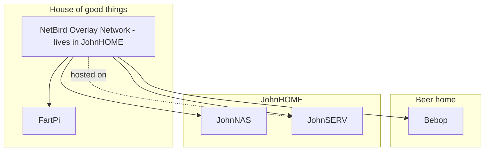
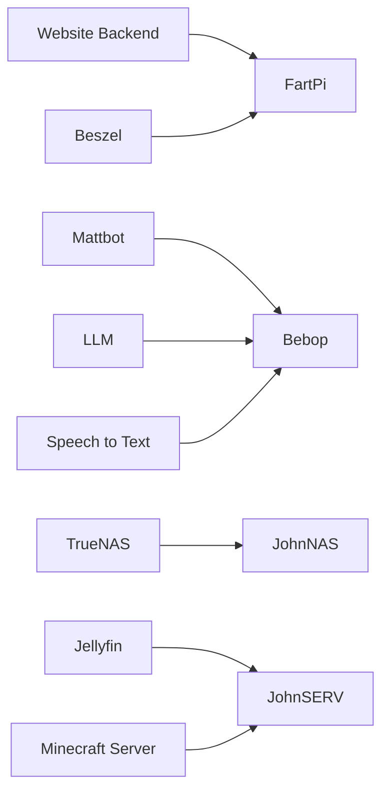
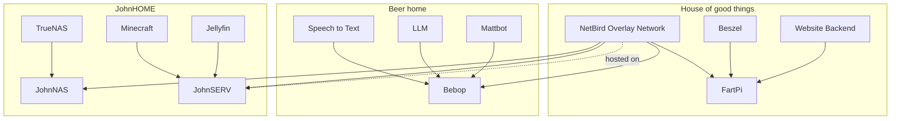

# Bird Wide Web

A secure network of self hosted servers, connected via NetBird

## Main nodes withing Bird Wide Web

Tyler - 'House of Good things' ip, runs on 'fart-pi' (raspberry pi 5). Main programs include: Website Backend API providing forum (Public Square) and photo galleries for his personal website (https://tyler-schwenk.com/). API accessible at https://api.tyler-schwenk.com. Also running Beszel and NetBird.

John - 'JohnHOME' ip, runs JohnNAS and JohnSERV (please fill in these details, john). main programs include: hosting the NetBird Overlay Network, minecraft server, Jellyfin movie streamer.

Kyle - 'Beer Home', runs on Orin AGX, hosts ML based services including 'Mattbot'.

---

# Topology



---

# NetBird Access

All host-to-host connectivity in this lab is expected to run over NetBird.

1. Install NetBird on your client and sign in to the same NetBird network.
2. Verify your peer is connected in the NetBird dashboard.
3. Connect to services using each node's NetBird IP or DNS name.

Example:

```bash
ssh user@<netbird-hostname-or-ip>
```

---

# Sites

## JohnSERV

| Site | Server | URL |
| --- | --- | --- |
| Jellyfin | JohnSERV | http://100.124.56.240:8096/ |

## Beer Home

| Site | Server | URL |
| --- | --- | --- |
| MattBot (TTS API) | Bebop | http://\<bebop-netbird-ip\>:8000 |

See [docs/services/mattbot.md](services/mattbot.md) for setup and usage.

---

# Services



---

# Full View

